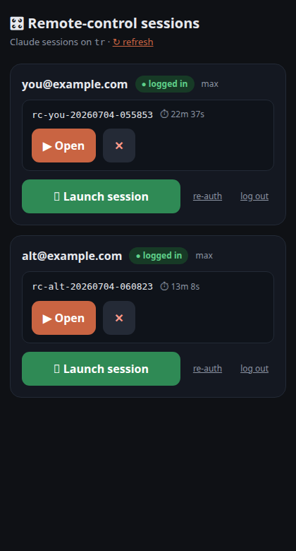
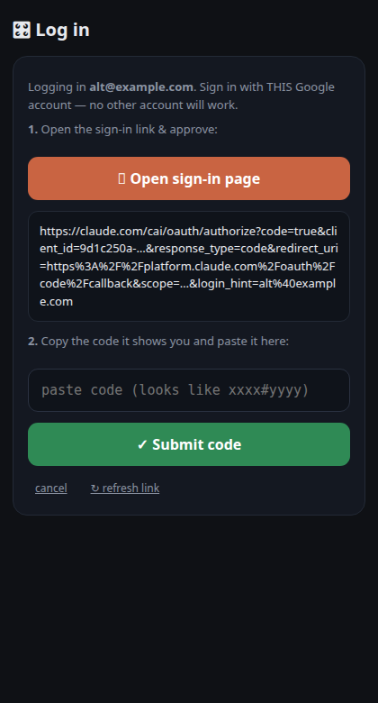
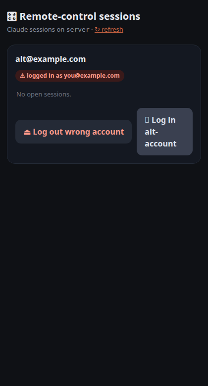

# claude-rc-launcher

A tiny, dependency-free, mobile-first web dashboard for launching and managing
**remote-controlled Claude Code sessions** (`claude --remote-control`) on a
headless server — for one or more Claude accounts.

Open one secret URL from your phone → tap **Launch session** → a Claude Code
session spawns in tmux on your server and appears in your Claude mobile/desktop
app, ready to drive from anywhere.

| Dashboard | In-page OAuth login | Wrong-account guard |
|---|---|---|
|  |  |  |

## Features

- **One secret URL is the whole auth model** — a long random path segment,
  validated in-process, rotatable in seconds without touching root.
- **Multi-account** — each account gets its own `CLAUDE_CONFIG_DIR`, auth badge
  (logged in / logged out / ⚠ wrong account), and session list.
- **In-page OAuth login** — tap the sign-in link, approve in the browser, paste
  the code back into the page; the dashboard feeds it to the CLI. Log out and
  wrong-account recovery included.
- **Sessions survive service restarts** — the systemd unit uses
  `KillMode=process` so redeploying the launcher never kills your live sessions.
- **Zero dependencies** — single-file Python stdlib server + tmux + the Claude
  Code CLI. No database, no framework, no build step.

## Requirements

- Linux with systemd (user units), `tmux`, Python 3.9+
- [Claude Code CLI](https://docs.claude.com/en/docs/claude-code) installed and
  on PATH (or point `claude_bin` at it)
- A reverse proxy with TLS (nginx example included) — or a VPN/tailnet if you
  prefer not to expose it

## Setup

```bash
git clone https://github.com/YOURNAME/claude-rc-launcher
cd claude-rc-launcher

# 1. Secrets — the URL path IS the credential
echo rc$(openssl rand -hex 6) | tr -d '\n' > prefix.txt
openssl rand -hex 32 | tr -d '\n' > secret.txt
chmod 600 prefix.txt secret.txt

# 2. Accounts + machine knobs
cp accounts.example.json accounts.json   # edit: your account(s)
cp config.example.json config.json       # edit: paths/port if needed

# 3. (multi-account) seed extra config dirs so onboarding never blocks a launch
./seed-account.sh ~/.claude-alt

# 4. Run as a user service
mkdir -p ~/.config/systemd/user
cp rc-launcher.service ~/.config/systemd/user/   # edit paths inside
systemctl --user daemon-reload
systemctl --user enable --now rc-launcher.service
loginctl enable-linger $USER   # keep it running after logout

# 5. Reverse proxy: see nginx-rc.conf.example, include it in your TLS server{}
```

Your dashboard is then at:

```
https://your.domain/<prefix.txt>/<secret.txt>
```

## Managing

- Rotate the secret (no root): `openssl rand -hex 32 | tr -d '\n' > secret.txt && systemctl --user restart rc-launcher.service`
- Live sessions: `tmux ls | grep rc-` · audit log: `launches.log`
- Kill a session: ✕ on the dashboard, or `tmux kill-session -t rc-<stamp>`

## Hard-won gotchas baked in

These cost real debugging time; the code already handles them:

- **`CLAUDE_CONFIG_DIR` moves the CLI's state file** to
  `$CLAUDE_CONFIG_DIR/.claude.json`. A fresh dir re-triggers first-run
  onboarding (theme picker → login select → folder trust) and a headless
  launch hangs there forever. `seed-account.sh` pre-seeds
  `theme`, `hasCompletedOnboarding`, and folder trust.
- **`KillMode=process`** in the unit — with the default `control-group`,
  restarting the launcher kills the tmux server and every session in it.
- **`tmux capture-pane -J`** — long OAuth URLs wrap across pane rows; without
  `-J` no regex will ever match them.
- **Claude needs a real PTY** — pipe its stdout and it flips to `--print`
  mode and exits; hence tmux rather than a subprocess pipe.
- **Login-state ≠ identity** — the dashboard compares the authenticated email
  to the account slot's expected email, so logging into the wrong Google
  account shows "⚠ wrong account" + a one-tap logout instead of wedging.

## Security notes

- The server binds `127.0.0.1` only; the secret path is checked before any
  action; everything else 404s and is logged with the client IP.
- The secret URL grants the ability to run Claude Code on your box as your
  user. Treat it like an SSH key: share with no one, rotate freely.
- Session names are validated against a strict regex before being passed to
  tmux (no shell injection via the kill endpoint).

## License

MIT
